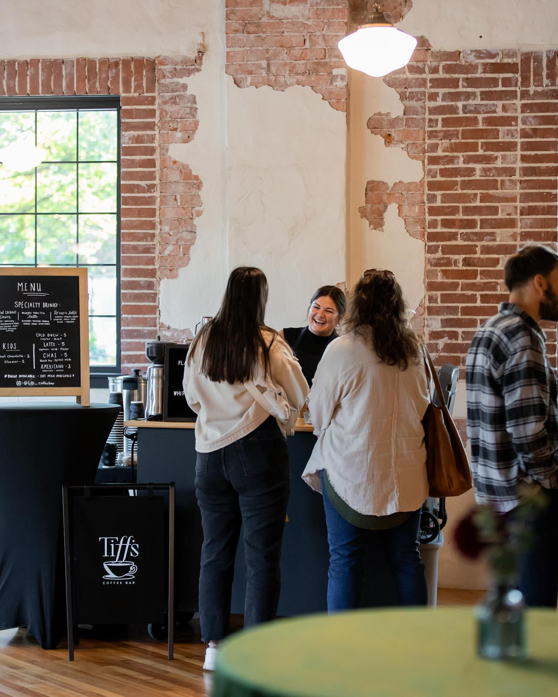

# Tiff's Coffee Bar ☕✨

A modern, cozy, and immersive portfolio website for **Tiff's Coffee Bar**, where comfort meets coffee. This project features a unique blend of warm coffee aesthetics and a whimsical space-themed preloader, built with high-performance web technologies.



## 🚀 Features

*   **Immersive Experience**:
    *   **Custom Preloader**: A unique "Space Coffee" loading animation featuring a self-drawing mug, rising steam, and a background of drifting stars, nebulas, and planets.
    *   **Smooth Animations**: Powered by `framer-motion` for scroll reveals, text effects, and interactive elements.
*   **Interactive Menu**:
    *   Tabbed interface for switching between "Coffee" and "Specialty" drinks.
    *   "Gooey" filter effects on tab switching.
    *   Hover effects on menu items.
*   **Gallery**:
    *   Responsive grid layout.
    *   Lightbox modal for viewing full-size images.
*   **Locations & Contact**:
    *   Interactive map integration.
    *   Embedded Google Form for community engagement.
    *   Schedule view with calendar integration.
*   **Performance & Accessibility**:
    *   **Lazy Loading**: Images and components are lazy-loaded to speed up initial render.
    *   **Accessibility (a11y)**: Semantic HTML, ARIA roles, and keyboard navigation support.
    *   **Responsive**: Fully optimized for mobile, tablet, and desktop devices.

## 🛠️ Tech Stack

*   **Framework**: [React](https://react.dev/) + [Vite](https://vitejs.dev/)
*   **Language**: [TypeScript](https://www.typescriptlang.org/)
*   **Styling**: [Tailwind CSS](https://tailwindcss.com/)
*   **Animations**: [Framer Motion](https://www.framer.com/motion/)
*   **Routing**: [React Router](https://reactrouter.com/) (HashRouter for GitHub Pages)
*   **Icons**: [Lucide React](https://lucide.dev/)

## 📦 Getting Started

1.  **Clone the repository**
    ```bash
    git clone https://github.com/flogert/tiffs-portfolio.git
    cd tiffs-portfolio
    ```

2.  **Install dependencies**
    ```bash
    npm install
    ```

3.  **Run the development server**
    ```bash
    npm run dev
    ```

4.  **Build for production**
    ```bash
    npm run build
    ```

## 🌍 Deployment

This project is configured for deployment on **GitHub Pages**.

1.  The `vite.config.ts` is set with `base: "/tiffs-portfolio/"`.
2.  Routing uses `HashRouter` to ensure compatibility with static hosting.
3.  To deploy, simply push to the `main` branch (if a workflow is set up) or run the build command and deploy the `dist` folder.

## 🎨 Credits

*   Designed and developed for Tiff's Coffee Bar.
*   Images sourced from local assets.

---

*Where coffee sparks conversation and community feels like home.*
